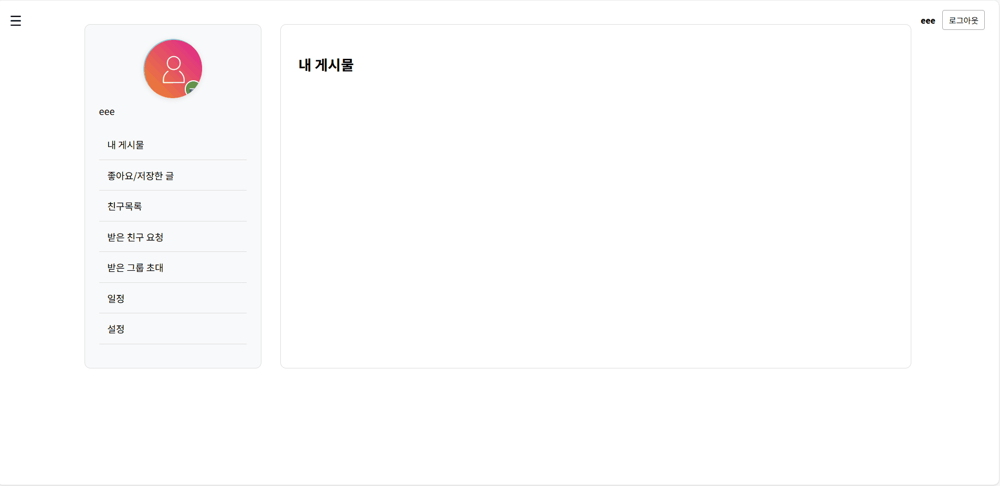
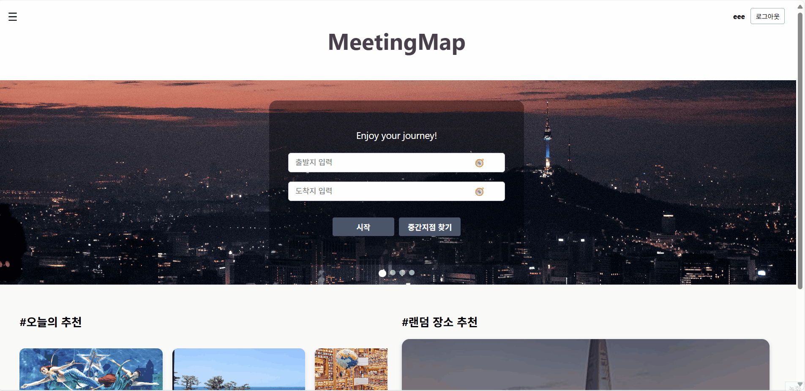

# 🎓 Capstone Project

## 📌 "MeetingMap" — 알고있조

---

## 👨‍👩‍👧‍👦 팀원 소개

- **홍상준 (팀장)**: 프론트엔드, 백엔드 연동
- **어현우**: 백엔드, 앱 개발
- **손완진**: 백엔드, 알고리즘 개발 (중간 장소 검색, 자동 스케줄링)
- **박성주**: 프론트엔드, UI/UX 설계 및 구현

---

## 💻 구현 사이트

[클릭](https://meeting-map.kro.kr)

## 🧭 프로젝트 개요

> **경로 기반 장소 추천 + 자동 스케줄링 서비스**

출발지와 도착지만 입력하면, 경로를 따라 다양한 장소를 자동 추천하고  
시각적 UI를 통해 스케줄을 빠르게 구성할 수 있는 스마트 플랫폼입니다.

사용자는 직접 정보를 검색하는 번거로움 없이,  
**시간과 노력을 절약하며 최적화된 일정**을 손쉽게 완성할 수 있습니다.

---

## 🛠 기술 스택

- **개발 환경**: Windows, Linux
- **프레임워크**: Spring Boot, React
- **API**: Kakao API, Tmap API, Google Places API, OpenAI API, Tour API
- **DB**: MySQL
- **언어**: Java, JavaScript
- **IDE**: IntelliJ, VSCode

## 🎥 시연 영상

<table width="100%">
  <tr>
    <th>회원가입/로그인</th>
    <th>메인페이지</th>
  </tr>
  <tr>
    <td></td>
    <td></td>
  </tr>
  <tr>
    <th>지도 출력(출발지-도착지)</th>
    <th>지도 출력(다중 입력 후 중간지점)</th>
  </tr>
  <tr>
    <td></td>
    <td></td>
  </tr>
  <tr>
    <th>스케줄 생성</th>
    <th>게시판+글쓰기</th>
  </tr>
  <tr>
    <td></td>
    <td></td>
  </tr>
  <tr>
    <th>마이페이지</th>
    <th>Group</th>
  </tr>
  <tr>
    <td></td>
    <td></td>
  </tr>
</table>

---

## 🧩 주요 기능 소개

---

### 🗺️ 1. 메인 페이지

- 출발지/도착지 입력 시 중간지점 자동 탐색 기능
- **오늘의 추천**: 금일 추천 게시글 자동 출력
- **랜덤 장소 추천**: 약속 장소 정하기 어려울 때 랜덤 추천 제공

> 📝 중간지점 탐색은 최대 4개의 출발지를 기준으로 자동 분석합니다.

---

### 📝 2. 게시판 페이지

- 카테고리별 게시판: 맛집, 카페, 놀거리, 일정/코스
- 실사용 후기 작성 및 인기글 추천 기능
- 글쓰기, 댓글, 저장, Q&A 기능 포함

> 📝 사용자 간 장소 정보 공유 커뮤니티 기능으로 구성되어 있습니다.

---

### 🧭 3. 지도/카테고리 페이지

- 선택 위치 기반 장소 시각화
- 카테고리별 필터링 (관광지, 음식점 등)
- 차량 / 대중교통 / 도보 경로 지원

> 📝 카테고리 선택 시 마커 자동 출력 + 경로 탐색 연동

---

### 📅 4. 스케줄 생성 페이지

- AI 기반 추천 스케줄 제공
- 직접 장소를 추가/삭제하여 일정 생성 가능
- 지도 위에 경로 및 마커 표시로 시각적 이해도 향상

> 📝 생성된 스케줄은 저장되어 마이페이지에서 관리할 수 있습니다.

---

### 🙋‍♂️ 5. 마이페이지

- 내가 쓴 글, 좋아요한 글, 저장한 글 관리
- 친구 목록 및 개인 일정 조회
- 사용자 정보 설정 가능

> 📝 개인화 기능 중심의 사용자 전용 페이지 구성

---

### 🔐 6. 로그인 / 회원가입

- 일반 로그인 / 회원가입
- **카카오 로그인** 연동: 카카오 계정으로 간편 인증

> 📝 소셜 로그인과 일반 로그인 모두 지원하여 접근성 향상

## 🎯 기대효과

- **일정 계획 시간 절약**
- **리뷰 기반 추천**으로 신뢰도 있는 정보 제공
- **친구·연인과의 약속**, **소규모 모임** 일정 최적화
- **대중교통 소요 시간 예측**, **카테고리 필터링** 등 고급 기능 포함

> 기존 지도 앱과 차별화된, **경로 기반 맞춤형 장소 추천 & 자동 스케줄링 플랫폼**으로서 가치가 큽니다.

---

## 📝 REST API 목록

| API 호출                                                                                                      | 기능                             |
| ------------------------------------------------------------------------------------------------------------- | -------------------------------- |
| [POST /user/check-id](Capstone/docs/UserAPI.md#아이디-중복-검사)                                              | 아이디 중복 검사                 |
| [POST /user/register](Capstone/docs/UserAPI.md#회원가입)                                                      | 회원가입                         |
| [GET /user](Capstone/docs/UserAPI.md#회원-정보-조회)                                                          | 회원 정보 조회                   |
| [GET /user/list](Capstone/docs/UserAPI.md#전체-회원-조회)                                                     | 전체 회원 조회                   |
| [PUT /user](Capstone/docs/UserAPI.md#회원-정보-변경)                                                          | 회원 정보 변경                   |
| [GET /user/boards](Capstone/docs/UserAPI.md#작성한-글-조회)                                                   | 작성한 글 조회                   |
| [GET /user/boards/liked](Capstone/docs/UserAPI.md#좋아요한-글-조회)                                           | 좋아요한 글 조회                 |
| [GET /user/boards/scraped](Capstone/docs/UserAPI.md#저장한-글-조회)                                           | 저장한 글 조회                   |
| [GET /user/groups](Capstone/docs/UserAPI.md#속한-그룹-조회)                                                   | 속한 그룹 조회                   |
| [POST /user/password](Capstone/docs/UserAPI.md#비밀번호-변경)                                                 | 비밀번호 변경                    |
| [DELETE /user](Capstone/docs/UserAPI.md#회원-탈퇴)                                                            | 회원 탈퇴                        |
| [POST /auth/login](Capstone/docs/AuthAPI.md#로그인)                                                           | 로그인                           |
| [POST /auth/kakao](Capstone/docs/AuthAPI.md#카카오-로그인)                                                    | 카카오 로그인                    |
| [POST /auth/logout](Capstone/docs/AuthAPI.md#로그아웃)                                                        | 로그아웃                         |
| [GET /boards](Capstone/docs/BoardAPI.md#게시글-조회)                                                          | 게시글 조회                      |
| [GET /boards/category](Capstone/docs/BoardAPI.md#카테고리-조회)                                               | 카테고리 조회                    |
| [GET /boards/{boardNo}](Capstone/docs/BoardAPI.md#게시글-상세-조회)                                           | 게시글 상세 조회                 |
| [POST /boards](Capstone/docs/BoardAPI.md#게시글-등록)                                                         | 게시글 등록                      |
| [PUT /boards/{boardNo}](Capstone/docs/BoardAPI.md#게시글-수정)                                                | 게시글 수정                      |
| [DELETE /boards/{boardNo}](Capstone/docs/BoardAPI.md#게시글-삭제)                                             | 게시글 삭제                      |
| [POST /boards/{boardNo}/like](Capstone/docs/BoardAPI.md#좋아요-토글)                                          | 좋아요 토글                      |
| [POST /boards/{boardNo}/hate](Capstone/docs/BoardAPI.md#싫어요-토글)                                          | 싫어요 토글                      |
| [POST /boards/{boardNo}/scrap](Capstone/docs/BoardAPI.md#저장스크랩-토글)                                     | 저장(스크랩) 토글                |
| [GET /user/friends](Capstone/docs/FriendshipAPI.md#친구-목록-조회)                                            | 게시글 조회                      |
| [GET /user/friends/sent](Capstone/docs/FriendshipAPI.md#보낸-친구-요청-조회)                                  | 보낸 친구 요청 조회              |
| [GET /user/friends/received](Capstone/docs/FriendshipAPI.md#받은-친구-요청-조회)                              | 받은 친구 요청 조회              |
| [POST /user/friends/add](Capstone/docs/FriendshipAPI.md#친구-추가)                                            | 친구 추가                        |
| [POST /user/friends/approve](Capstone/docs/FriendshipAPI.md#친구-요청-수락)                                   | 친구 요청 수락                   |
| [DELETE /user/friends](Capstone/docs/FriendshipAPI.md#친구-삭제)                                              | 친구 삭제                        |
| [GET /map/category](Capstone/docs/MapAPI.md#카테고리-조회)                                                    | 카테고리 조회                    |
| [GET /map](Capstone/docs/MapAPI.md#지도-출력)                                                                 | 지도 출력                        |
| [GET /map/detail](Capstone/docs/MapAPI.md#장소-세부-정보-출력)                                                | 장소 세부 정보 출력              |
| [GET /map/autocomplete](Capstone/docs/MapAPI.md#장소명-자동완성)                                              | 장소명 자동완성                  |
| [POST /path/pedestrian](Capstone/docs/PathAPI.md#스케줄로-보행자-길찾기)                                      | 스케줄로 보행자 길찾기           |
| [POST /path/car](Capstone/docs/PathAPI.md#스케줄로-자동차-길찾기)                                             | 스케줄로 자동차 길찾기           |
| [POST /path/transit](Capstone/docs/PathAPI.md#스케줄로-대중교통-길찾기)                                       | 스케줄로 대중교통 길찾기         |
| [GET /path/pedestrian](Capstone/docs/PathAPI.md#장소-이름으로-보행자-길찾기)                                  | 장소 이름으로 보행자 길찾기      |
| [GET /path/car](Capstone/docs/PathAPI.md#장소-이름으로-자동차-길찾기)                                         | 장소 이름으로 자동차 길찾기      |
| [GET /path/transit](Capstone/docs/PathAPI.md#장소-이름으로-대중교통-길찾기)                                   | 장소 이름으로 대중교통 길찾기    |
| [GET /schedules](Capstone/docs/ScheduleAPI.md#자신이-만든-스케줄-조회)                                        | 자신이 만든 스케줄 조회          |
| [POST /schedules/create](Capstone/docs/ScheduleAPI.md#스케줄-생성)                                            | 스케줄 생성                      |
| [POST /schedules](Capstone/docs/ScheduleAPI.md#스케줄-저장)                                                   | 스케줄 저장                      |
| [PUT /schedules](Capstone/docs/ScheduleAPI.md#스케줄-수정)                                                    | 스케줄 수정                      |
| [DELETE /schedules/{scheduleNo}](Capstone/docs/ScheduleAPI.md#스케줄-삭제)                                    | 스케줄 삭제                      |
| [GET /boards/{boardNo}/comments](Capstone/docs/CommentAPI.md#특정-게시글-댓글-조회)                           | 특정 게시글 댓글 조회            |
| [POST /boards/{boardNo}/comments](Capstone/docs/CommentAPI.md#댓글-등록)                                      | 댓글 등록                        |
| [PUT /comments/{commentNo}](Capstone/docs/CommentAPI.md#댓글-수정)                                            | 댓글 수정                        |
| [DELETE /comments/{commentNo}](Capstone/docs/CommentAPI.md#댓글-삭제)                                         | 댓글 삭제                        |
| [GET /groups/{groupNo}](Capstone/docs/GroupAPI.md#그룹-조회)                                                  | 그룹 조회                        |
| [GET /groups/{groupNo}/members](Capstone/docs/GroupAPI.md#그룹-멤버-조회)                                     | 그룹 멤버 조회                   |
| [GET /groups/members](Capstone/docs/GroupAPI.md#소속되어있는-전체-그룹-멤버-조회)                             | 소속되어있는 전체 그룹 멤버 조회 |
| [POST /groups](Capstone/docs/GroupAPI.md#그룹-생성)                                                           | 그룹 생성                        |
| [PUT /groups/{groupNo}](Capstone/docs/GroupAPI.md#그룹-수정)                                                  | 그룹 수정                        |
| [DELETE /groups/{groupNo}](Capstone/docs/GroupAPI.md#그룹-삭제)                                               | 그룹 삭제                        |
| [DELETE /groups/{groupNo}/members/{deleteUserId}](Capstone/docs/GroupAPI.md#그룹-멤버-강제-탈퇴)              | 그룹 멤버 강제 탈퇴              |
| [POST /groups/invitations](Capstone/docs/GroupAPI.md#그룹-초대)                                               | 그룹 초대                        |
| [GET /groups/invitations](Capstone/docs/GroupAPI.md#그룹-초대-목록-조회)                                      | 그룹 초대 목록 조회              |
| [POST /groups/invitations/{invitationNo}/{status}](Capstone/docs/GroupAPI.md#그룹-초대-수락거절)              | 그룹 초대 수락/거절              |
| [POST /groups/{groupNo}/schedules](Capstone/docs/GroupAPI.md#그룹-내-스케줄-공유)                             | 그룹 내 스케줄 공유              |
| [GET /groups/{groupNo}/schedules](Capstone/docs/GroupAPI.md#그룹-내-공유된-스케줄-조회)                       | 그룹 내 공유된 스케줄 조회       |
| [DELETE /groups/{groupNo}/schedules/{scheduleNo}](Capstone/docs/GroupAPI.md#공유-스케줄-삭제)                 | 공유 스케줄 삭제                 |
| [GET /groups/{groupNo}/boards](Capstone/docs/GroupBoardAPI.md#그룹-전체-게시글-조회)                          | 그룹 전체 게시글 조회            |
| [POST /groups/{groupNo}/boards](Capstone/docs/GroupBoardAPI.md#그룹-게시글-등록)                              | 그룹 게시글 등록                 |
| [DELETE /groups/{groupNo}/boards/{groupBoardNo}](Capstone/docs/GroupBoardAPI.md#그룹-게시글-삭제)             | 그룹 게시글 삭제                 |
| [POST /groups/{groupNo}/boards/{groupBoardNo}/comments](Capstone/docs/GroupBoardAPI.md#그룹-게시글-댓글-등록) | 그룹 게시글 댓글 등록            |
