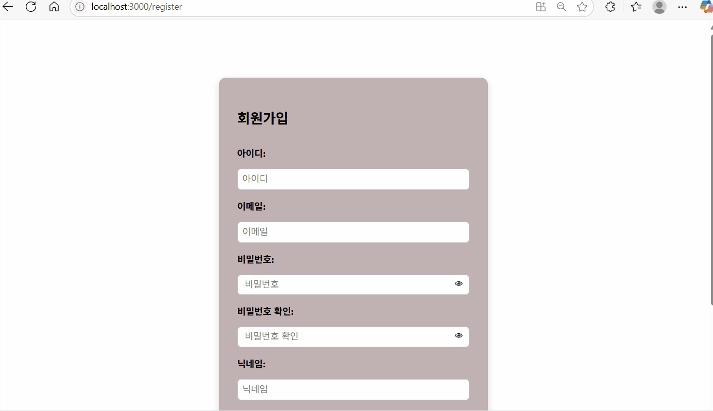

# 🎓 Capstone Project  

## 📌 "MeetingMap" — 알고있조  

---  

## 👨‍👩‍👧‍👦 팀원 소개

- **홍상준 (팀장)**: 프론트엔드, 백엔드 연동  
- **어현우**: 백엔드, 앱 개발  
- **손완진**: 백엔드, 알고리즘 개발 (중간 장소 검색, 자동 스케줄링)  
- **박성주**: 프론트엔드, UI/UX 설계 및 구현

---  

## 🧭 프로젝트 개요

> **경로 기반 장소 추천 + 자동 스케줄링 서비스**

출발지와 도착지만 입력하면, 경로를 따라 다양한 장소를 자동 추천하고  
시각적 UI를 통해 스케줄을 빠르게 구성할 수 있는 스마트 플랫폼입니다.

사용자는 직접 정보를 검색하는 번거로움 없이,  
**시간과 노력을 절약하며 최적화된 일정**을 손쉽게 완성할 수 있습니다.

---  

## 🛠 기술 스택

- **개발 환경**: Windows  
- **프레임워크**: Spring Boot, React, React Native  
- **API**: Kakao Map API, Tmap API, Tour API  
- **DB**: MySQL  
- **언어**: Java, JavaScript  
- **IDE**: IntelliJ, VSCode

## 🎥 시연 영상

<table width="100%">
  <tr>
    <th>회원가입/로그인</th>
    <th>메인페이지</th>
  </tr>
  <tr>
    <td></td>
    <td></td>
  </tr>
  <tr>
    <th>3</th>
    <th>4</th>
  </tr>
  <tr>
    <td></td>
    <td></td>
  </tr>
  <tr>
    <th>5</th>
    <th>6</th>
  </tr>
  <tr>
    <td></td>
    <td></td>
  </tr>
  <tr>
    <th>7</th>
    <th>8</th>
  </tr>
  <tr>
    <td></td>
    <td></td>
  </tr>
  <tr>
    <th>9</th>
    <th>10</th>
  </tr>
  <tr>
    <td></td>
    <td></td>
  </tr>
</table>

---

## 🧩 주요 기능 소개   

**1. 메인 페이지**: 출발지와 목적지 입력, 오늘의 추천(게시판 내의 글 중 금일에 맞는 추천 게시글 업로드), 랜덤 장소 추천(약속 장소를 정하는 데에 어려움이 있을 때 랜덤으로 추천) 기능 구현  

**2. 게시판 페이지**: 카테고리별로(맛집, 카페, 놀거리, 일정 및 코스) 회원들의 실제 후기 및 인기글 추천, Q&A와 같은 소통 기능 구현  

**3. 지도/카테고리 페이지**: 지도 화면 구현 및 선택 위치 카테고리별 장소 추천 기능 구현   

**4. 스케줄 생성 페이지**: 맞춤형 스케줄링 추천 및 직접 작성 가능, 위치 기반 장소 추천까지 해주어 원활한 스케줄링 가능하도록 기능 구현  

**5. 마이페이지**: 사용자가 작성한 게시글, 좋아요/저장한 글, 친구 목록, 개인 일정 목록 및 설정 기능 구현  
  

---  

## 🎯 기대효과  

- **일정 계획 시간 절약**  
- **리뷰 기반 추천**으로 신뢰도 있는 정보 제공  
- **친구·연인과의 약속**, **소규모 모임** 일정 최적화  
- **대중교통 소요 시간 예측**, **카테고리 필터링** 등 고급 기능 포함

> 기존 지도 앱과 차별화된, **경로 기반 맞춤형 장소 추천 & 자동 스케줄링 플랫폼**으로서 가치가 큽니다.

---

## 📝 REST API 목록
| API 호출                                                  | 기능                 |
|---------------------------------------------------------|--------------------|
| `POST /user/check-id`                                   | 아이디 중복 검사          |
| `POST /user/register`                                   | 회원가입               |
| `GET /user`                                             | 회원 정보 조회           |
| `GET /user/list`                                        | 전체 회원 조회           |
| `PUT /user`                                             | 회원 정보 변경           |
| `GET /user/boards`                                      | 작성한 글 조회           |
| `GET /user/boards/liked`                                | 좋아요한 글 조회          |
| `GET /user/boards/scraped`                              | 저장한 글 조회           |
| `GET /user/groups`                                      | 속한 그룹 조회           |
| `POST /user/password`                                   | 비밀번호 변경            |
| `DELETE /user`                                          | 회원 탈퇴              |
| `POST /auth/login`                                      | 로그인                |
| `POST /auth/kakao`                                      | 카카오 로그인            |
| `POST /auth/logout`                                     | 로그아웃               |
| `GET /boards`                                           | 게시글 조회             |
| `GET /boards/category`                                  | 카테고리 조회            |
| `GET /boards/{boardNo}`                                 | 게시글 상세 조회          |
| `POST /boards`                                          | 게시글 작성             |
| `PUT /boards/{boardNo}`                                 | 게시글 수정             |
| `DELETE /boards/{boardNo}`                              | 게시글 삭제             |
| `POST /boards/{boardNo}/like`                           | 좋아요 토글             |
| `POST /boards/{boardNo}/hate`                           | 싫어요 토글             |
| `POST /boards/{boardNo}/scrap`                          | 저장(스크랩) 토글         |
| `GET /user/friends`                                     | 친구 목록 조회           |
| `GET /user/friends/received`                            | 받은 친구 요청 조회        |
| `POST /user/friends/add`                                | 친구 추가              |
| `POST /user/friends/approve`                            | 친구 요청 수락           |
| `DELETE /user/friends`                                  | 친구 삭제              |
| `GET /map/category`                                     | 카테고리 조회            |
| `GET /map`                                              | 장소 조회              |
| `GET /map/detail`                                       | 장소 세부 정보 조회        |
| `GET /map/autocomplete`                                 | 장소명 자동완성           |
| `POST /path/pedestrian`                                 | 스케줄로 보행자 길찾기       |
| `POST /path/car`                                        | 스케줄로 자동차 길찾기       |
| `POST /path/transit`                                    | 스케줄로 대중교통 길찾기      |
| `GET /path/pedestrian`                                  | 장소 이름으로 보행자 길찾기    |
| `GET /path/car`                                         | 장소 이름으로 자동차 길찾기    |
| `GET /path/transit`                                     | 장소 이름으로 대중교통 길찾기   |
| `GET /schedules`                                        | 자신이 만든 스케줄 조회      |
| `GET /schedules/{scheduleNo}/members`                   | 스케줄에 참여한 회원 조회     |
| `POST /schedules/create`                                | 스케줄 생성             |
| `POST /schedules`                                       | 스케줄 저장             |
| `PUT /schedules`                                        | 스케줄 수정             |
| `DELETE /schedules/{scheduleNo}`                        | 스케줄 삭제             |
| `POST /schedules/share`                                 | 스케줄 공유             |
| `POST /schedules/unshare`                               | 스케줄 공유 취소          |
| `GET /boards/{boardNo}/comments`                        | 특정 게시글 댓글 조회       |
| `POST /boards/{boardNo}/comments`                       | 댓글 등록              |
| `PUT /comments/{commentNo}`                             | 댓글 수정              |
| `DELETE /comments/{commentNo}`                          | 댓글 삭제              |
| `GET /groups/{groupNo}`                                 | 그룹 조회              |
| `GET /groups/{groupNo}/members`                         | 그룹 멤버 조회           |
| `GET /groups/members`                                   | 소속되어있는 전체 그룹 멤버 조회 |
| `POST /groups`                                          | 그룹 생성              |
| `PUT /groups/{groupNo}`                                 | 그룹 수정              |
| `DELETE /groups/{groupNo}`                              | 그룹 삭제              |
| `DELETE /groups/{groupNo}/members/{deleteUserId}`       | 그룹 멤버 강제 탈퇴        |
| `POST /groups/invitations`                              | 그룹 초대              |
| `GET /groups/invitations`                               | 그룹 초대 목록 조회        |
| `POST /groups/invitations/{invitationNo}/{status}`      | 그룹 초대 수락/거절        |
| `POST /groups/{groupNo}/schedules`                      | 그룹 내 스케줄 공유        |
| `GET /groups/{groupNo}/schedules`                       | 그룹 내 공유된 스케줄 조회    |
| `DELETE /groups/{groupNo}/schedules/{scheduleNo}`       | 공유 스케줄 삭제          |
| `GET /groups/{groupNo}/boards`                          | 그룹 전체 게시글 조회       |
| `POST /groups/{groupNo}/boards`                         | 그룹 게시글 등록          |
| `DELETE /groups/{groupNo}/boards/{groupBoardNo}`        | 그룹 게시글 삭제          |
| `POST /groups/{groupNo}/boards/{groupBoardNo}/comments` | 그룹 게시글 댓글 등록       |